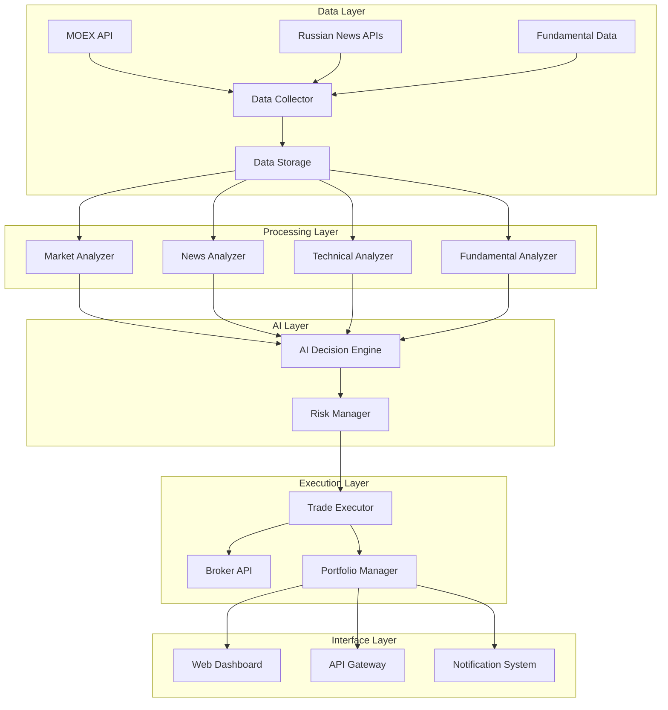

# Design Document

## Overview

The AI-powered Russian Stock Trading Bot is a comprehensive system designed to analyze the Russian stock market (MOEX), process Russian financial news, and execute automated trading decisions. The system combines real-time market data analysis, sentiment analysis of Russian news sources, technical and fundamental analysis, and risk management specifically tailored for the Russian market environment.

The architecture follows a modular, microservices-based approach that allows for easy scaling, maintenance, and integration of new features. The system is designed to handle the unique characteristics of the Russian market, including trading hours, currency considerations, regulatory requirements, and Russian-language content processing.

## Architecture

### High-Level Architecture



### System Components

1. **Data Collection Service**: Aggregates data from multiple Russian sources
2. **Market Analysis Service**: Processes MOEX market data and technical indicators
3. **News Analysis Service**: Analyzes Russian financial news using NLP
4. **AI Decision Engine**: Makes trading decisions based on all available data
5. **Risk Management Service**: Implements Russian market-specific risk controls
6. **Trade Execution Service**: Executes trades through Russian brokers
7. **Portfolio Management Service**: Tracks positions and performance
8. **Dashboard Service**: Provides Russian-language user interface

## Components and Interfaces

### Data Collection Service

**Purpose**: Collect and normalize data from various Russian market sources

**Key Features**:
- MOEX API integration for real-time stock prices, volumes, and market data
- Russian news aggregation from RBC, Vedomosti, Kommersant, Interfax
- Fundamental data collection from Russian financial databases
- Data validation and normalization for Russian market specifics

**Interfaces**:
```python
class DataCollector:
    def fetch_moex_data(self, symbols: List[str]) -> MarketData
    def fetch_russian_news(self, keywords: List[str]) -> List[NewsArticle]
    def fetch_fundamental_data(self, symbol: str) -> FundamentalData
    def validate_data(self, data: Any) -> bool
```

### Market Analysis Service

**Purpose**: Analyze MOEX market data and generate technical indicators

**Key Features**:
- Technical indicator calculations adapted for Russian market patterns
- Volume analysis considering MOEX trading characteristics
- Support/resistance level identification
- Trend analysis with Russian market volatility considerations

**Interfaces**:
```python
class MarketAnalyzer:
    def calculate_technical_indicators(self, symbol: str) -> TechnicalIndicators
    def analyze_volume_patterns(self, symbol: str) -> VolumeAnalysis
    def identify_support_resistance(self, symbol: str) -> SupportResistance
    def analyze_market_trends(self, symbols: List[str]) -> MarketTrends
```

### News Analysis Service

**Purpose**: Process Russian financial news and extract market sentiment

**Key Features**:
- Russian language NLP processing
- Sentiment analysis for Russian financial terminology
- Entity recognition for Russian companies and market events
- Impact assessment on specific stocks

**Interfaces**:
```python
class NewsAnalyzer:
    def analyze_sentiment(self, article: NewsArticle) -> SentimentScore
    def extract_entities(self, text: str) -> List[Entity]
    def assess_market_impact(self, article: NewsArticle) -> ImpactScore
    def categorize_news(self, article: NewsArticle) -> NewsCategory
```

### AI Decision Engine

**Purpose**: Make trading decisions based on all available analysis

**Key Features**:
- Multi-factor decision making combining technical, fundamental, and sentiment analysis
- Russian market-specific trading strategies
- Confidence scoring for each decision
- Reasoning explanation in Russian language

**Interfaces**:
```python
class AIDecisionEngine:
    def generate_trading_signals(self, symbol: str) -> TradingSignal
    def calculate_position_size(self, signal: TradingSignal, portfolio: Portfolio) -> float
    def explain_decision(self, signal: TradingSignal) -> str
    def update_strategy_parameters(self, performance_data: PerformanceData) -> None
```

### Risk Management Service

**Purpose**: Implement comprehensive risk controls for Russian market

**Key Features**:
- Russian market volatility-adjusted stop losses
- Portfolio diversification rules considering Russian market sectors
- Geopolitical risk assessment and adjustment
- Currency risk management (RUB volatility)

**Interfaces**:
```python
class RiskManager:
    def validate_trade(self, trade: TradeOrder) -> ValidationResult
    def calculate_stop_loss(self, symbol: str, entry_price: float) -> float
    def assess_portfolio_risk(self, portfolio: Portfolio) -> RiskAssessment
    def adjust_for_market_conditions(self, risk_params: RiskParameters) -> RiskParameters
```

### Trade Execution Service

**Purpose**: Execute trades through Russian brokers with MOEX integration

**Key Features**:
- Integration with Russian broker APIs (Tinkoff, Finam, etc.)
- MOEX trading rules compliance
- Order management with Russian market specifics
- Transaction logging for Russian regulatory compliance

**Interfaces**:
```python
class TradeExecutor:
    def place_order(self, order: TradeOrder) -> ExecutionResult
    def cancel_order(self, order_id: str) -> bool
    def get_order_status(self, order_id: str) -> OrderStatus
    def calculate_trading_costs(self, order: TradeOrder) -> TradingCosts
```

## Data Models

### Core Data Structures

```python
@dataclass
class RussianStock:
    symbol: str  # MOEX ticker (e.g., "SBER", "GAZP")
    name: str    # Russian company name
    sector: str  # Russian market sector
    currency: str = "RUB"
    lot_size: int = 1
    
@dataclass
class MarketData:
    symbol: str
    timestamp: datetime
    price: float
    volume: int
    bid: float
    ask: float
    currency: str = "RUB"
    
@dataclass
class NewsArticle:
    title: str
    content: str
    source: str  # RBC, Vedomosti, etc.
    timestamp: datetime
    language: str = "ru"
    mentioned_stocks: List[str]
    
@dataclass
class TradingSignal:
    symbol: str
    action: str  # "BUY", "SELL", "HOLD"
    confidence: float
    target_price: float
    stop_loss: float
    reasoning: str  # In Russian
    timestamp: datetime
    
@dataclass
class Portfolio:
    positions: Dict[str, Position]
    cash_balance: float
    currency: str = "RUB"
    total_value: float
    daily_pnl: float
```

### Database Schema

**Stocks Table**:
- symbol (VARCHAR, PRIMARY KEY)
- name (VARCHAR)
- sector (VARCHAR)
- currency (VARCHAR)
- lot_size (INTEGER)

**Market Data Table**:
- id (BIGINT, PRIMARY KEY)
- symbol (VARCHAR, FOREIGN KEY)
- timestamp (TIMESTAMP)
- price (DECIMAL)
- volume (BIGINT)
- bid (DECIMAL)
- ask (DECIMAL)

**News Table**:
- id (BIGINT, PRIMARY KEY)
- title (TEXT)
- content (TEXT)
- source (VARCHAR)
- timestamp (TIMESTAMP)
- sentiment_score (DECIMAL)
- mentioned_stocks (JSON)

**Trades Table**:
- id (BIGINT, PRIMARY KEY)
- symbol (VARCHAR)
- action (VARCHAR)
- quantity (INTEGER)
- price (DECIMAL)
- timestamp (TIMESTAMP)
- reasoning (TEXT)
- status (VARCHAR)

## Error Handling

### Error Categories

1. **Data Source Errors**:
   - MOEX API unavailability
   - News source timeouts
   - Data format inconsistencies

2. **Market Errors**:
   - Trading halts
   - Circuit breakers
   - After-hours trading restrictions

3. **Broker Errors**:
   - Insufficient funds
   - Order rejection
   - Connection failures

4. **System Errors**:
   - AI model failures
   - Database connectivity issues
   - Service unavailability

### Error Handling Strategy

```python
class ErrorHandler:
    def handle_data_source_error(self, error: DataSourceError) -> None:
        # Fallback to cached data or alternative sources
        # Log error for monitoring
        # Notify administrators if critical
        
    def handle_market_error(self, error: MarketError) -> None:
        # Pause trading if market is closed
        # Adjust strategies for market conditions
        # Queue orders for when market reopens
        
    def handle_broker_error(self, error: BrokerError) -> None:
        # Retry with exponential backoff
        # Switch to alternative broker if available
        # Log failed trades for manual review
        
    def handle_system_error(self, error: SystemError) -> None:
        # Graceful degradation
        # Switch to safe mode
        # Alert system administrators
```

## Testing Strategy

### Unit Testing
- Individual component testing with mock Russian market data
- AI decision engine testing with historical MOEX data
- News analysis testing with Russian financial articles
- Risk management testing with various market scenarios

### Integration Testing
- End-to-end trading workflow testing
- MOEX API integration testing
- Russian broker API integration testing
- Database integration testing

### Performance Testing
- Load testing with high-frequency market data
- Stress testing during volatile market conditions
- Latency testing for real-time decision making
- Memory usage optimization testing

### Security Testing
- API security testing
- Data encryption validation
- Access control testing
- Compliance with Russian data protection laws

### Market Simulation Testing
- Backtesting with historical Russian market data
- Paper trading with live market data
- Stress testing with extreme market conditions
- A/B testing of different trading strategies

### Test Data Management
- Historical MOEX data for backtesting
- Synthetic Russian news articles for NLP testing
- Mock broker responses for integration testing
- Compliance test scenarios for regulatory validation

The testing strategy ensures the system can handle the unique challenges of the Russian market, including high volatility, regulatory requirements, and Russian-language content processing.