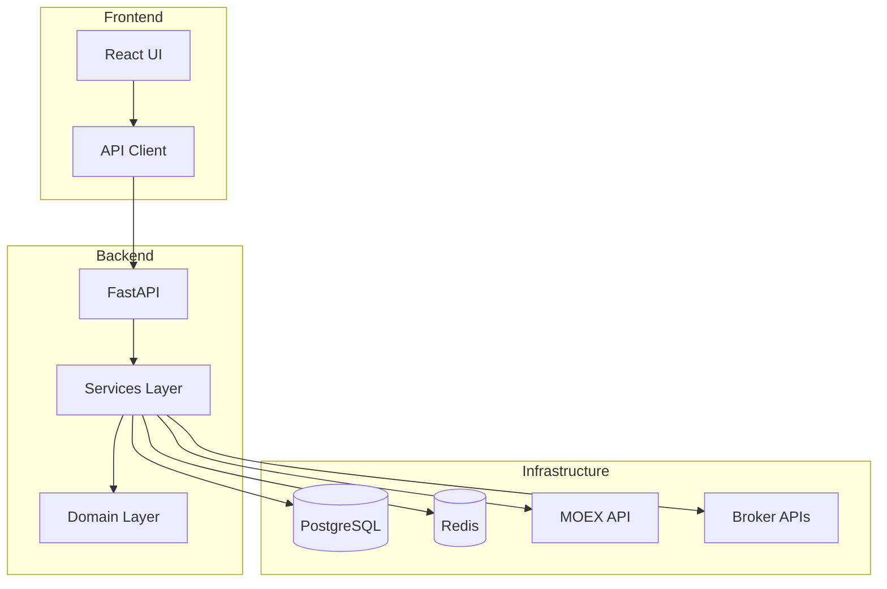
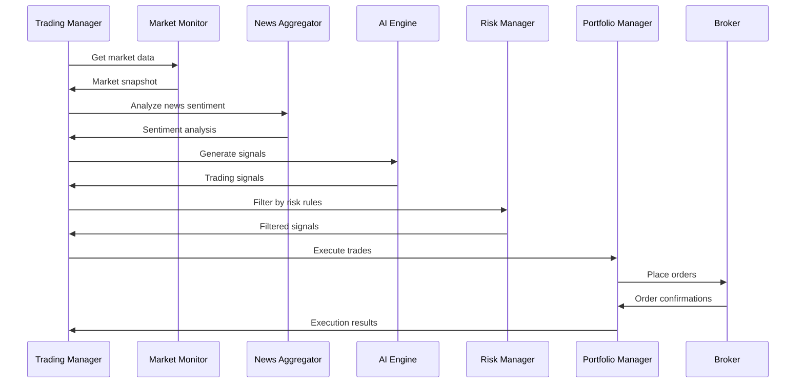

# 🏗️ Архитектура Russian Trading Bot

## 📋 Обзор системы

Russian Trading Bot построен по принципам чистой архитектуры с разделением на слои и использованием современных паттернов проектирования. Система спроектирована для высокой производительности, масштабируемости и надежности при работе с российским фондовым рынком.

## 🎯 Архитектурные принципы

### SOLID Принципы
- **Single Responsibility** - каждый класс имеет одну ответственность
- **Open/Closed** - открыт для расширения, закрыт для модификации
- **Liskov Substitution** - подклассы должны заменять базовые классы
- **Interface Segregation** - интерфейсы должны быть специфичными
- **Dependency Inversion** - зависимость от абстракций, а не от конкретных реализаций

### Дополнительные принципы
- **DRY** (Don't Repeat Yourself) - избегание дублирования кода
- **KISS** (Keep It Simple, Stupid) - простота решений
- **YAGNI** (You Aren't Gonna Need It) - не реализуем то, что не нужно сейчас
- **Separation of Concerns** - разделение ответственности между компонентами

## 🏛️ Архитектурные слои

```
┌─────────────────────────────────────────────────────────────┐
│                    Presentation Layer                        │
│  ┌─────────────────┐  ┌─────────────────┐  ┌──────────────┐ │
│  │   Web UI        │  │   REST API      │  │   WebSocket  │ │
│  │   (React)       │  │   (FastAPI)     │  │   (Real-time)│ │
│  └─────────────────┘  └─────────────────┘  └──────────────┘ │
└─────────────────────────────────────────────────────────────┘
                                │
┌─────────────────────────────────────────────────────────────┐
│                   Application Layer                          │
│  ┌─────────────────┐  ┌─────────────────┐  ┌──────────────┐ │
│  │   Use Cases     │  │   Orchestrators │  │   Workflows  │ │
│  │   (Services)    │  │   (Coordinators)│  │   (Sagas)    │ │
│  └─────────────────┘  └─────────────────┘  └──────────────┘ │
└─────────────────────────────────────────────────────────────┘
                                │
┌─────────────────────────────────────────────────────────────┐
│                    Domain Layer                              │
│  ┌─────────────────┐  ┌─────────────────┐  ┌──────────────┐ │
│  │   Entities      │  │   Value Objects │  │   Domain     │ │
│  │   (Models)      │  │   (DTOs)        │  │   Services   │ │
│  └─────────────────┘  └─────────────────┘  └──────────────┘ │
└─────────────────────────────────────────────────────────────┘
                                │
┌─────────────────────────────────────────────────────────────┐
│                 Infrastructure Layer                         │
│  ┌─────────────────┐  ┌─────────────────┐  ┌──────────────┐ │
│  │   Database      │  │   External APIs │  │   Message    │ │
│  │   (PostgreSQL)  │  │   (MOEX, Brokers│  │   Queue      │ │
│  └─────────────────┘  └─────────────────┘  └──────────────┘ │
└─────────────────────────────────────────────────────────────┘
```

## 🔧 Основные компоненты

### 1. Presentation Layer (Слой представления)

#### Web UI (React Frontend)
```typescript
// Компонентная архитектура React
src/
├── components/          # Переиспользуемые компоненты
│   ├── Trading/        # Торговые компоненты
│   ├── Analytics/      # Аналитические компоненты
│   └── Common/         # Общие компоненты
├── pages/              # Страницы приложения
├── hooks/              # Кастомные React хуки
├── services/           # API клиенты
└── store/              # Состояние приложения (Redux/Zustand)
```

#### REST API (FastAPI Backend)
```python
# Структура API эндпоинтов
api/
├── routers/
│   ├── trading.py      # Торговые операции
│   ├── analytics.py    # Аналитика и отчеты
│   ├── portfolio.py    # Управление портфелем
│   └── monitoring.py   # Мониторинг системы
├── middleware/         # Промежуточное ПО
├── dependencies.py     # Зависимости FastAPI
└── main.py            # Точка входа API
```

### 2. Application Layer (Слой приложения)

#### Core Services (Основные сервисы)
```python
services/
├── market_monitor.py           # Мониторинг рынка
├── news_aggregator.py         # Агрегация новостей
├── ai_decision_engine.py      # AI движок решений
├── risk_manager.py            # Управление рисками
├── portfolio_manager.py       # Управление портфелем
├── notification_service.py    # Сервис уведомлений
└── backtesting_engine.py      # Бэктестинг стратегий
```

#### Orchestrators (Оркестраторы)
```python
# Координация между сервисами
class TradingOrchestrator:
    async def execute_trading_cycle(self):
        # 1. Получение рыночных данных
        market_data = await self.market_monitor.get_snapshot()
        
        # 2. Анализ новостей
        news_sentiment = await self.news_aggregator.analyze_sentiment()
        
        # 3. Генерация торговых сигналов
        signals = await self.ai_engine.generate_signals(
            market_data, news_sentiment
        )
        
        # 4. Фильтрация по рискам
        filtered_signals = await self.risk_manager.filter_signals(signals)
        
        # 5. Исполнение сделок
        await self.portfolio_manager.execute_trades(filtered_signals)
```

### 3. Domain Layer (Доменный слой)

#### Entities (Сущности)
```python
# Основные бизнес-сущности
@dataclass
class Security:
    symbol: str
    name: str
    sector: str
    market_cap: Decimal
    
@dataclass  
class Position:
    security: Security
    quantity: int
    average_price: Decimal
    current_price: Decimal
    
@dataclass
class TradingSignal:
    security: Security
    action: TradeAction  # BUY, SELL, HOLD
    confidence: float
    target_price: Decimal
    stop_loss: Decimal
```

#### Value Objects (Объекты-значения)
```python
@dataclass(frozen=True)
class Price:
    value: Decimal
    currency: str = "RUB"
    
@dataclass(frozen=True)
class RiskMetrics:
    var_95: Decimal  # Value at Risk 95%
    max_drawdown: Decimal
    sharpe_ratio: float
    beta: float
```

### 4. Infrastructure Layer (Инфраструктурный слой)

#### Database (База данных)
```python
# Repository Pattern для работы с данными
class SecurityRepository:
    async def get_by_symbol(self, symbol: str) -> Security:
        pass
        
    async def get_by_sector(self, sector: str) -> List[Security]:
        pass
        
class PositionRepository:
    async def get_current_positions(self) -> List[Position]:
        pass
        
    async def update_position(self, position: Position) -> None:
        pass
```

#### External APIs (Внешние API)
```python
# Адаптеры для внешних сервисов
class MOEXAdapter:
    async def get_securities(self) -> List[SecurityData]:
        pass
        
class TinkoffBrokerAdapter:
    async def place_order(self, order: Order) -> OrderResult:
        pass
        
class NewsAPIAdapter:
    async def get_latest_news(self) -> List[NewsItem]:
        pass
```

## 🔄 Паттерны проектирования

### 1. Repository Pattern
```python
# Абстракция для работы с данными
class AbstractRepository(ABC):
    @abstractmethod
    async def add(self, entity: Entity) -> None:
        pass
        
    @abstractmethod
    async def get(self, id: str) -> Entity:
        pass

class SQLAlchemyRepository(AbstractRepository):
    def __init__(self, session: AsyncSession):
        self.session = session
        
    async def add(self, entity: Entity) -> None:
        self.session.add(entity)
        await self.session.commit()
```

### 2. Strategy Pattern
```python
# Различные торговые стратегии
class TradingStrategy(ABC):
    @abstractmethod
    async def generate_signals(self, data: MarketData) -> List[TradingSignal]:
        pass

class MomentumStrategy(TradingStrategy):
    async def generate_signals(self, data: MarketData) -> List[TradingSignal]:
        # Реализация momentum стратегии
        pass

class MeanReversionStrategy(TradingStrategy):
    async def generate_signals(self, data: MarketData) -> List[TradingSignal]:
        # Реализация mean reversion стратегии
        pass
```

### 3. Observer Pattern
```python
# Система уведомлений
class EventPublisher:
    def __init__(self):
        self._observers: List[Observer] = []
        
    def subscribe(self, observer: Observer) -> None:
        self._observers.append(observer)
        
    async def notify(self, event: Event) -> None:
        for observer in self._observers:
            await observer.handle(event)

class TelegramNotifier(Observer):
    async def handle(self, event: Event) -> None:
        if isinstance(event, TradingEvent):
            await self.send_telegram_message(event.message)
```

### 4. Factory Pattern
```python
# Фабрика для создания брокерских клиентов
class BrokerFactory:
    @staticmethod
    def create_broker(broker_type: str, config: dict) -> BrokerInterface:
        if broker_type == "tinkoff":
            return TinkoffBroker(config)
        elif broker_type == "finam":
            return FinamBroker(config)
        else:
            raise ValueError(f"Unknown broker type: {broker_type}")
```

## 📊 Диаграммы архитектуры

### Диаграмма компонентов


### Диаграмма последовательности торгового цикла


## 🔐 Безопасность архитектуры

### Принципы безопасности
1. **Defense in Depth** - многоуровневая защита
2. **Principle of Least Privilege** - минимальные необходимые права
3. **Fail Secure** - безопасное поведение при ошибках
4. **Input Validation** - валидация всех входных данных

### Компоненты безопасности
```python
# Аутентификация и авторизация
class SecurityService:
    async def authenticate_user(self, credentials: Credentials) -> User:
        pass
        
    async def authorize_action(self, user: User, action: str) -> bool:
        pass
        
# Шифрование данных
class EncryptionService:
    def encrypt_sensitive_data(self, data: str) -> str:
        pass
        
    def decrypt_sensitive_data(self, encrypted_data: str) -> str:
        pass
```

## 📈 Масштабируемость

### Горизонтальное масштабирование
- **Load Balancer** - распределение нагрузки
- **Microservices** - разделение на независимые сервисы
- **Message Queue** - асинхронная обработка
- **Database Sharding** - разделение данных

### Вертикальное масштабирование
- **Connection Pooling** - пулы соединений
- **Caching** - кэширование данных
- **Async Processing** - асинхронная обработка
- **Resource Optimization** - оптимизация ресурсов

## 🔍 Мониторинг и наблюдаемость

### Метрики
```python
# Prometheus метрики
from prometheus_client import Counter, Histogram, Gauge

TRADES_TOTAL = Counter('trades_total', 'Total number of trades')
TRADE_DURATION = Histogram('trade_duration_seconds', 'Trade execution time')
PORTFOLIO_VALUE = Gauge('portfolio_value_rub', 'Current portfolio value')
```

### Логирование
```python
# Структурированное логирование
import structlog

logger = structlog.get_logger()

await logger.info(
    "Trade executed",
    symbol="SBER",
    action="BUY",
    quantity=100,
    price=250.0,
    user_id="user123"
)
```

### Трейсинг
```python
# Distributed tracing с OpenTelemetry
from opentelemetry import trace

tracer = trace.get_tracer(__name__)

with tracer.start_as_current_span("execute_trade") as span:
    span.set_attribute("symbol", "SBER")
    span.set_attribute("action", "BUY")
    # Выполнение торговой операции
```

## 🧪 Тестирование архитектуры

### Пирамида тестирования
```
    /\
   /  \     E2E Tests (5%)
  /____\    
 /      \   Integration Tests (15%)
/________\  
           Unit Tests (80%)
```

### Типы тестов
- **Unit Tests** - тестирование отдельных компонентов
- **Integration Tests** - тестирование взаимодействия компонентов
- **Contract Tests** - тестирование API контрактов
- **Performance Tests** - тестирование производительности
- **Security Tests** - тестирование безопасности

## 📚 Дополнительные ресурсы

### Книги по архитектуре
- "Clean Architecture" - Robert C. Martin
- "Building Microservices" - Sam Newman
- "Patterns of Enterprise Application Architecture" - Martin Fowler

### Документация
- [FastAPI Documentation](https://fastapi.tiangolo.com/)
- [SQLAlchemy Documentation](https://docs.sqlalchemy.org/)
- [React Architecture Guide](https://reactjs.org/docs/thinking-in-react.html)

---

**Эта архитектура обеспечивает надежность, масштабируемость и поддерживаемость Russian Trading Bot 🏗️**